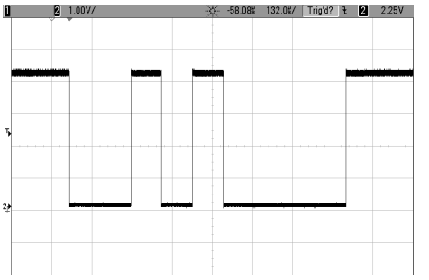
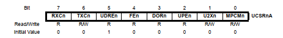

## Serial Communication
---
### Working
---
For a very basic definition, for computers or ICs to communicate with each other, one device sends a signal by outputting HIGH and LOW voltage pulses on a wire that connects it to the other device. The rules for encoding data into voltage pulses and decoing voltage pulses back to data is called the ***Serial protocol***


### Protocols
---
We’ll limit ourselves to the most common serial mode—universal asynchronous receive and transmit (UART) 
<br>
Consider the case where i need to send the digit 23 to a device. First I convert the decimal to binary   
```c
bin(23) = 0001 0111
```
If we decide to send the LSB first, the device will receive the following sequence:
```c
00001 01110
```

Note the additional 0 bit to indicate start and stop bit. There is also an additional parity bit commonly used on serial communication to detect errors. E.g checking if the number of 1's is odd or even, depending on your needs.

The following factors are very important in serial communication:
1. Baud rate
2. Start bit
3. Stop bit

The image below shows a typical waveform when transmitting serial data:<br>



### Registers used for serial communication
---
USART Communication uses 5 registers to enable serial communication functionality.The registers are:

1. UDRn - USART Data Register
2. UCSRnA - USART Control and Status Register A
3. UCSRnB - USART Control and Status Register B
4. UCSRnC - USART Control and Status Register C
5. UBRRnL and UBRRnH - USART Baud Rate Registers

The following snapshots show the stated registers.

1. UDRn - USART Data <br>
 
2. UCSRnA - USART Control and Status Register A<br>

3. UCSRnB - USART Control and Status Register B<br>

4. UCSRnC - USART Control and Status Register C<br>

5. UBRRnL and UBRRnH - USART Baud Rate Registers<br>


For more details on the register, please refer to the datasheet in the resources folder.


### Register Configuration
---
In this section we will show how you can configure the registers to start transmitting with your Atmel AVR microcontroller.

1. First of all, to transmit over serial, you need to initialize the serial registers. First check the set your baud rate using the UBRRH and UBRRL registers.

```c
UBRR0H = UBRRH_VALUE; /* defined in setbaud.h */
UBRR0L = UBRRL_VALUE; 
```
2. Enable TX and RX using the UCSR0A register. To be specific, use TXEN0 and RXEN0.
```c
UCSR0B = (1 << TXEN0) | (1 << RXEN0);
```
3. You can optionally check the value of the speed of transmission in register UCSR0A 
```c
    #if USE_2X
    UCSR0A |= (1 << U2X0)
    #else
    UCSR0A &= ~(1 << U2X0)
    #endif
```
4. Set the length of your data bit using the UCSRnC register.
```c
 UCSR0C = (1 << UCSZ01) | (1 << UCSZ00);   /* 8 data bits, 1 stop bit */
```

Based on these basic initilization code, the whole function looks as below:

```c

void initUSART(void) { /* requires BAUD */
  UBRR0H = UBRRH_VALUE; /* defined in setbaud.h */
  UBRR0L = UBRRL_VALUE;
  #if USE_2X
    UCSR0A |= (1 << U2X0); // set U2X0 
  #else
    UCSR0A &= ~(1 << U2X0); // clear U2X0
  #endif

    /* Enable USART transmitter/receiver */
  UCSR0B = (1 << TXEN0) | (1 << RXEN0);
  UCSR0C = (1 << UCSZ01) | (1 << UCSZ00);  /* 8 data bits, 1 stop bit */
}

```


### Transmitting
---
To transmit, write to the UDR-TX (USART data register). For example, If we have a sensor that reads say luminous intensity as 24 lumens, and we need to send this to our PC, we will write the value 24 to the UDR-TX register. 

For this to happen, wait until the UDR is clear, indicated by the UDRE0 in the UCSR0A being set, then write data to UDR0

This looks as below:
```c
void transmit(uint8_t data){
    loop_until_bit_is_set(UCSR0A, UDRE0); // wait for empty transmit buffer
    UDR = data; // write data to UDR-TX
}
```

### Receiving
---
To receive data, read from the UDR-RX register. Say for example we need to send a command to a device through the serial terminal. For example lets say we have a module that we want to send the command GT:SEND to perform a specific function. The MCU will listen for this command on the serial port.

For this to happen, when data comes in, the RXC0 bit in UCSR0A will be set, and you can read the incoming data out of UDR-RX.

This looks as below:
```c
void receive(void){
    loop_until_bit_is_set(UCSR0A, RXC0); // wait for incoming data
    return UDR0; // return register value
}
```

### Further making
---
You would create header files for the the above functions, namely ***usart.h*** and ***usart.cpp*** and use them in your main files that require USART communication

Other uses of serial communication include:
1.  Debugging. The ability to send out info about
the AVR’s state over the serial line can be
priceless
2. Using LCD and VFD displays that take serial
input
3. Making your own GPS datalogger is fairly
easy, because GPS modules usually send out
their location data using a USART-style serial
protocol.
4. Integrating card-readers, both magnetic stripe and RFID, into your designs, because
they often send their data to you in USART
serial.
5. Sending data via radio protocols, because
most use USART encoded in various ways

Feel free to explore!!