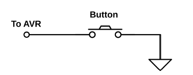
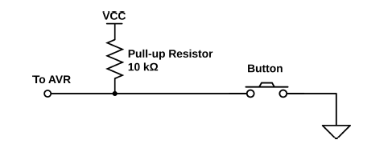
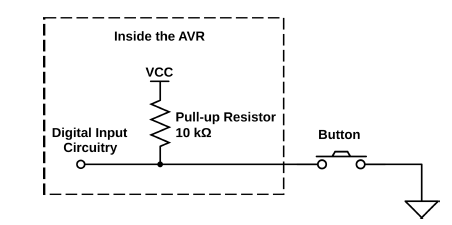

## Introduction
---
Push buttons are a very common device used for input in most AVR projects. Push buttons are cheap, ubiquitous and a natural choice for quick and mostly painless human/AVR interaction.

Here, we will take the pushbutton as a stand in for all types of digital input. 

<br>
Push buttons have a few things you should know about. 
1. They often bounce very rapidly betweewn the on and off states when presses or released.
2. Often, you are interested in running an action when the button is first pressed rather than continously while it is pressed

AVR is good at sensing voltages. In particular, they are good at sensing whether an applied voltage on a particular pin is higher or lower than half of the supply voltage. We need to figure out how to apply logic high and low voltages to an AVR pin by a way of a push button. 

<br>
The image below shows a naive connection of a push button. <br>



<br>
The problem with the above connections is that if the button has not been pressed, the input to th AVR controller is undefined. The exposed wire acts like an antenna and the input to that pin is unreliable.

To combat this, we use a pull-up resistor. So we always know the pin is always high.
 <br>
 The image below shows this connection. <br>



<br>
Relatively large resistors are used so that when the button is pressed, it creates a low impedance path to ground, and ocly a small current will flow through the circuit. If the pull-up resistor is large enough, the voltage seen by the AVR is close to 0.

<br>
AVR controllers provide you with an internal pull-up resistors. You have an option to activate it for any pin that is in input mode. 

This looks as below: <br>

<br>

## Configuring Input(DDRs, PORTs AND PINs)
---
Input is the default mode for AVR pins. If you have not touched the DDR yet, you are already in the input mode. Otherwise, you can select input mode for a pin at any time by clearing the bits that correspond to your pin in the right DDR.

Suppose you want tit read te state of pin PD2., the pin connectoed to your push button. When the chip is powered, every pin is already in input mode, so that all that remains is to enable the pull-up resistor.

<br>

To set the internal pull up resistor, set the output pin hardware register. That is, if you would like to enable the pull-up on PD2, you need to set PORTD's corresponding pin bit high.

```c
DDRD &= ~(1 << PD2); // makes double-sure we're in input mode
PORTD |= (1 << PD2); // enables pull-up resistor
```

## Accessing input bits
---
To access input bits, we read out a byte from the hardware register and do some bit twiddling. (Please refer to bit manioulation lesson).
You read the input hardware register address; PIND.

Lets say you have just connected the internal pull up, no button press and youu hae just reset the AVR controller. 

```c
DDRD = 0x00; // all pins in input mode, just to be sure
PORTD = 0xff; // all pins pull-ups enabled
```

If you look at the byte in PIND, you will see this:

```c
PIND = 1111 1111;
```

Why? Because nothing is grounded yet. All pull-ups make sure all the input pins are at logic HIGH. 
If you press the button, PIND changes to the following:

```c
PIND = 1111 1011;

```

We can work with this.

## Interpreting button presses
---
Testing the bits is done with the AND operator. You know that an AND operator will only return a 1 if both bits are 1. If you perform AND operation in which you compare a unknown bit value against a known 1, you will get the state of the mystery bit as the result. 

### Testing bits with AND
---
Say we are interested in testing if bit 2 is set. The first step is to create a bitmask with a 1 in bit 2. 

```c
(1<<2) : 0000 00100

```
Then we AND that byte with whatever is in the input register, PIND:
```c

PIND : xxxxxxxx
(1 << 2) : 00000100
& : 00000x00

```
If the value we are interested in is a zero, the result is eight zeroes. If the results is not a zero, then we know the pin in the input register must have been set. 

So basically we can test this:

```c

if (PIND & (1<<2)){
    doStuff();
}

```

Please note that AVR has created useful macros for checking bits, clearing bits and more. You should include ```c <avr/io.h> ``` to use these macros. A snippet is shown below:

```c

#define _BV(bit) (1 << (bit))

#define bit_is_set(sfr, bit) (_SFR_BYTE(sfr) & _BV(bit))
#define bit_is_clear(sfr, bit) (!(_SFR_BYTE(sfr) & _BV(bit)))
#define loop_until_bit_is_set(sfr, bit) do { } while (bit_is_clear(sfr, bit))

```

## Simple button demo code
---

```c
/*
Demo of the simplest on/off button code
Button connected to PD2
LEDs connected to PB0..PB7
*/
// ------- Preamble -------- //
#include <avr/io.h>
#include <util/delay.h>


int main(void) {
    // -------- Inits --------- //
    PORTD |= (1 << PD2); /* initialize pullup resistor on our input pin */

    DDRB = 0xff; /* set up all LEDs for output */

    // ------ Event loop ------ //
    while (1) {
        if (bit_is_clear(PIND, PD2)) { /* look for button press */
            /* equivalent to if ((PIND & (1 << PD2)) == 0 ){ */
            PORTB = 0b00111100; /* pressed */
        }
        else { /* not pressed */
            PORTB = 0b11000011;
        }
    } /* End event loop */
    return (0);
}

```

Notice that we enable the pull up resistor for the button pin(PD2) by writing to PORTD.

A high voltage on the AVR's pin results in a logical 1 inside the AVR, and the switch voltage is high when when the button is not pressed, PIND has a 1 in bit PD2 when the button is not pressed. Oppositely, when the butto is pressed, this bit will read a zero. So if you are testing for a bit, you will want to check if this bit is clear.

## Changing state
---
You may ultimately want to know whether the button just got pressed or just got released. That is you may want to know the sate of the button This means you need to know the difference between "when the button enters the pressed state" or "while the button is pressed". To remove this confusion, we need to store the current state of the button to be chacked. We use a variable to store this state.

```c
// ------- Preamble -------- //
#include <avr/io.h>
#include "pinDefines.h"

int main(void) {

    // -------- Inits --------- //
    uint8_t buttonWasPressed; /* state */
    BUTTON_PORT |= (1 << BUTTON); /* enable the pullup on the button */
    LED_DDR = (1 << LED0); /* set up LED for output */
    // ------ Event loop ------ //
    while (1) {
        if (bit_is_clear(BUTTON_PIN, BUTTON)) { /* button is pressed now */
            if (buttonWasPressed == 0) { /* but wasn't last time through */
                LED_PORT ^= (1 << LED0); /* do whatever */
                buttonWasPressed = 1; /* update the state */
            }
        }
        else { 
            /* button is not pressed now */
            buttonWasPressed = 0; /* update the state */
        }

    } /* End event loop */
    return (0); /* This line is never reached */
}
```

## Debouncing
---
The easiest solution to button debouncing is to wait a few milliseconds and then check to see if the button is still pressed or not before making any decisions. Because the button bounce only for a short time, waiting a bit longer and then double checking will ensure that we are not mistaking a bounce for a true change. 

### Debounce example
```c
    #include <avr/io.h>
    #include "pinDefines.h"
    #include <util/delay.h>
    #define DEBOUNCE_TIME 1000 /* microseconds */


    uint8_t debounce(void) {
        if (bit_is_clear(BUTTON_PIN, BUTTON)) { /* button is pressed now */
            _delay_us(DEBOUNCE_TIME);
            if (bit_is_clear(BUTTON_PIN, BUTTON)) { /* still pressed */
                return (1);
            }
        }
        return (0);
    }


    int main(void) {
        // -------- Inits --------- //
        uint8_t buttonWasPressed; /* state */
        BUTTON_PORT |= (1 << BUTTON); /* enable the pullup on the button */
        LED_DDR = (1 << LED0); /* set up LED for output */
        // ------ Event loop ------ //
        while (1) {
            if (debounce()) { /* debounced button press */
                if (buttonWasPressed == 0) { /* but wasn't last time through */
                LED_PORT ^= (1 << LED0); /* do whatever */
                buttonWasPressed = 1; /* update the state */
            }
        }
        else { /* button is not pressed now */
            buttonWasPressed = 0; /* update the state */
        }
        } /* End event loop */
        
        return (0); /* This line is never reached */
        }
```