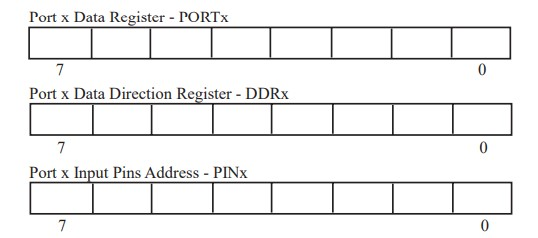

# Introduction

### Description
---
We are going to be using the ATMEGA328 Atmel MCU for this training. The sections below are short introductions to some core concepts.
<p>&nbsp;</p>

### Environment Setup
---
#### Software
1. Download and install [VS Code](https://code.visualstudio.com/)
2. Download and install [PlatformIO IDE](https://platformio.org/) for VS code

#### Hardware
1. Any Arduino Uno board but recommended is the Arduino Uno. Plus if you get the ATMEGA328P microcontroller itself also would be good.


### ATMEGA328 Architecture Overview
---
ATMEGA328 is a modified [Harvard architecture](https://www.geeksforgeeks.org/harvard-architecture/) 8-bit RISC Processor. The Atmel ATMEGA328 is equipped with 32 general purpose 8-bit registers that are tightly coupled to the processors ALU and CPU for faster instruction execution.
<p>&nbsp;</p>

The atmega328p has external connections for power supplies(VCC and GND), external time base inputs to drvie its clocks(XTAL1 and XTAL2), processor reset (active low RESET) and 4 8-bit ports (PA0-PA7, PB0-PB7, PC0-PC7, PD0-PD7), which arre used to interact with the external world.  
These ports may be used as GPIO or for alternate functions.   
The Atmeg328 also contains a timer subsystem, an ADC, an anlog caomparator, an interrupt system, a timing-subsytem, memory compnents, and extensive serial communication features. 


### C-Operator Sizing
---
When programming microcontrollers, it is important to know the number of bits used to store the variable and where the variable will be assigned. 
The following table shows type-sizing:
|Type| Size (bytes)|
|----|----|
|Unsigned char| 1|
|Signed char|1|
|Unsigned int|2|
|Signed int| 2|
|Float|4|
|Double|4|

For instance you cannot assign a 16-bit type to a 8-bit output port. The results will be unpredictable

# The PORT System
---
As stated above, the Atmega328 has 4 b-bit general purpose ports designated:  
1. PORTA
2. PORTB
3. PORTC
4. PORTD

In this section, we concetrate on the basic I/O port features. <br>
Each port has 3 registers associated with it:
1. Data Register PORTx -> Used to write data to the port
2. Data Direction Register(DDRx) -> Used to set a specific port pin to either output(1) or input(0)
3. Input Pin Address PINx -> Uses to read input data from the port. <br>



Note: Pins are usually configured at the start of a program. The DDRx is first used to set the pins pins as either input or output, then the data register (PORTx) is used to set the initial value of the output pins.

### Bit Twiddling
---
Bit twiddling is basically manipulation of individual bits on a given port without affecting other bits. 
|Syntax| Description|Example|
|---|---|---|
|a\|b| bitwise OR | PORTA \|=0x80; // turn on bit 7|
|a&b| bitwise AND | PORTA &=0x81; // check bit 7 and bit 0|
|a^b| bitwise Exclusive OR | PORTA^=0x80; // flip bit 7|
|~a| bitwise Complement | PORTA &=~0x80; // turn off bit 7|

You can read more [here](https://www.codementor.io/@erikeidt/bit-twiddling-understanding-bit-operations-iqj68ynb7).


### Bitwise operations summary table
---
|A|B|A \| B|A & B| A ^ B|
|---|---|---|---|---|
|0|0|0|0|0|
|0|1|1|0|1|
|1|0|1|0|1|
|1|1|1|1|0|

1. Bitwise Shift Operators => (left-shift)<<   (right-shift)>>

### Setting bits
---
Let's say we have a variable called bits and we wat to set bit 7. In this case we OR this variable with (1<<7)

```c
bits = bits | (1<<7); // set bit 7
bits |= (1<<7); // can also be written like this

```

### Inverting bits (Toggle bits)
---
Let's say we want to invert bit 6
'''c
bits = bits ^ (1<<6); // toggle bit 6
'''

### Testing bits
---
To test whether a bit is set or not, form a bit mask with a 1 in the bit position of interest.
For example, say we want to test for bit 5.

```c
bitmask = (1<<5);
bitmask = 0x64; // can be written this way

if((bits & bitmask) == 0){
	// this means that the bit being tested is a 0. Not set (AND) operation
}


```

### Clearing bits
---
Let's say we want to clear bit 7 (Make it 0). This can be accomplished using bitwise-AND operator

```c
bits = bits & ~(1<<7); // clear bit 7

// you can also write
bits &= ~(1<<7);

// note
// (1<<7) = 1000 0000
// ~(1<<7) = 0111 1111

```

A mask should be as wide as its operand. If bits is a 32-bit data type, the assignment must be
32-bit.

## Monitoring a specific bit
---
We often need to read the status of a flag in hardware register. The flag bit controls or indicates a hardware feature. 
They are also useful when reading, writing to and from microchip. So we continously monitor these bits to carry out
 a desired function by the microchip. Let's say we want to monitor the 5th bit for any change. 
 
 ```c
 
 while(bits & (1<<5)){
	...
	...
 }
 

```
 
 If the 5th bit of the bits variable is 1, the result of '''c bits & (1<<5) ''' will always be 1. This evaluates to true and the code gets executed.
 

To monitor the bit change from 1 to 0, we only need to negate the condition in the while loop.

 ```c
 
 while(~(bits & (1<<5))){
	...
	...
 }
 

 ```
 
 ## Summary
 ---
 Bitwise operators save memory and are fast leading to improved perfomance.